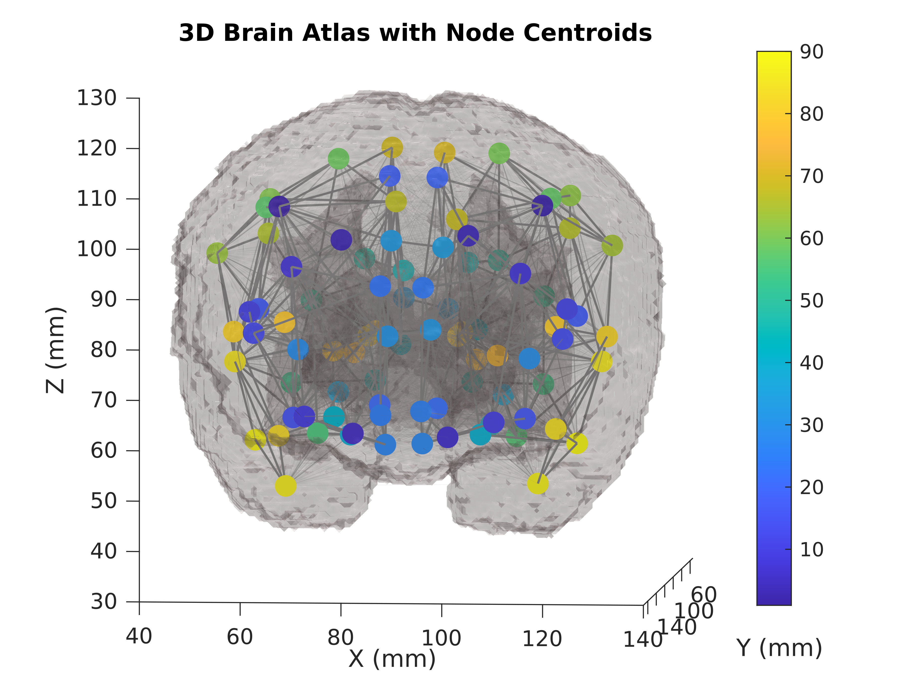
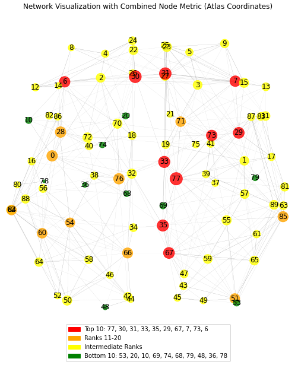
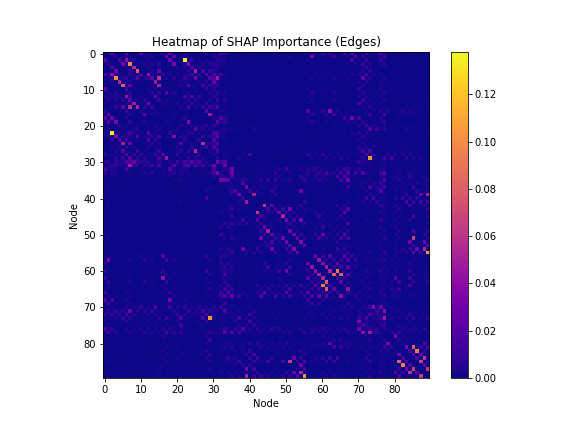

# Brain Connectivity Classification with Fuzzy Logic and Explainable AI

[](https://opensource.org/licenses/MIT)
[](https://ecai2025.org/)

Classification of **preterm vs. term infant brain structural connectivity** using machine learning and graph neural networks, enhanced with **fuzzy logic label smoothing** and **SHAP explainability**. Published at ECAI 2025 (CEUR Workshop Proceedings).


## Pipeline

<p align="center">
  
</p>

*End-to-end pipeline: structural connectivity matrices from dHCP → feature extraction → ML/GNN classification with fuzzy labels → SHAP-based explainability.*

## Overview

Preterm birth disrupts critical neurodevelopmental processes during the final trimester. This project uses structural connectomes (DTI-derived 90×90 adjacency matrices) from the Developing Human Connectome Project (dHCP) to classify infants as preterm or term. Key contributions:

1. **Spatial coordinate augmentation** — Atlas-based centroid coordinates as node features improve LR accuracy from 88.6% to 93.3%.
2. **Fuzzy logic label smoothing** — A sigmoidal soft target around the 37-week threshold boosts accuracy to **96.2%**.
3. **SHAP explainability** — Edge-importance matrices and node-level aggregation identify key brain regions consistent with neuroscience literature.

## Fuzzy Logic

<p align="center">
  
</p>

*Sigmoidal fuzzy membership function: $y_i^{\text{soft}} = \sigma\left(\frac{GA_i - 37}{T}\right)$. This replaces the hard binary label, reflecting the continuous nature of brain development around the 37-week boundary.*

## SHAP Explainability

<p align="center">
  
  
</p>

*Left: Brain network showing edge importance from SHAP analysis. Right: Node-level aggregation highlighting thalamus, putamen, and cingulum as key discriminative regions.*

### SHAP Heatmap

<p align="center">
  
</p>

*Heatmap of edge-level SHAP importance across all 90 brain regions.*

## Results

Best model: **LR + Spatial Coordinates + Fuzzy Logic → 96.2% accuracy**

| Model | Type | Accuracy |
|---|---|---|
| Logistic Regression | Matrix | 88.6% |
| LR + Spatial | Matrix | 93.3% |
| **LR + Spatial + Fuzzy** | **Matrix** | **96.2%** |
| GAT | Graph | 90.0% |
| GCN | Graph | 89.0% |

| Class | Precision | Recall | F1 |
|---|---|---|---|
| Preterm | 0.95 | 0.86 | 0.90 |
| Term | 0.97 | 0.99 | 0.98 |
| **Weighted Avg** | **0.96** | **0.96** | **0.96** |

## Project Structure

```
├── configs/
│   └── config.yaml
├── src/
│   ├── model.py              # ML + GNN classifiers
│   ├── fuzzy.py              # Fuzzy label smoothing
│   ├── explainability.py     # SHAP analysis pipeline
│   ├── data_loader.py        # dHCP data loader
│   └── __init__.py
├── paper/
│   ├── main.tex
│   ├── references.bib
│   └── figures/
└── scripts/
    └── run_experiment.sh
```

## Data

Data from the [Developing Human Connectome Project (dHCP)](http://www.developingconnectome.org/), processed by [Taoudi-Benchekroun et al.](https://github.com/CoDe-Neuro/Predicting-age-and-clinical-risk-from-the-neonatal-connectome). 524 neonatal structural connectomes (90 brain regions). **No data files are included.**

## Quick Start

```bash
pip install -r requirements.txt
python -m src.model --config configs/config.yaml
```

## Citation

```bibtex
@inproceedings{birch2025exploring,
  title={Exploring Structural Brain Connectivity in Term and Preterm Infants with Explainable AI and Fuzzy Logic},
  author={Birch, Katherine and Dur{\'a}n L{\'o}pez, Alberto and Bola{\~n}os Martinez, Daniel and Pravin, Chandresh and Berm{\'u}dez Edo, Mar{\'\i}a del Campo and Bauer, Roman and De, Suparna and others},
  year={2025},
  organization={CEUR Workshop Proceedings}
}
```

## License

MIT License — see [LICENSE](LICENSE).
