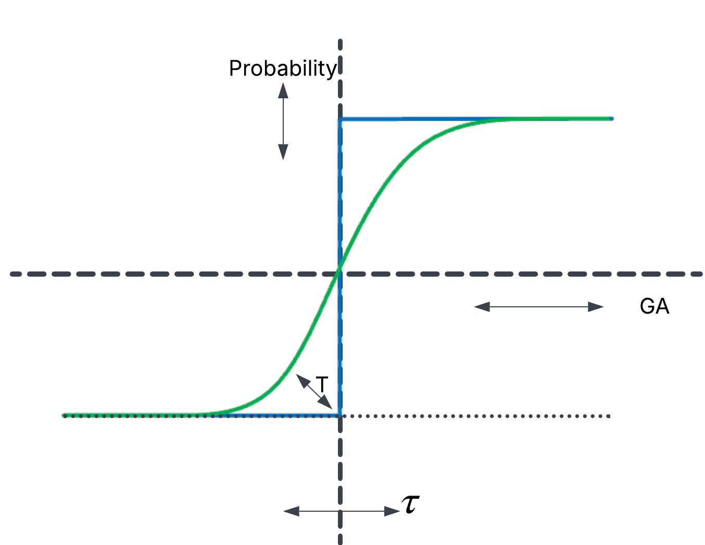
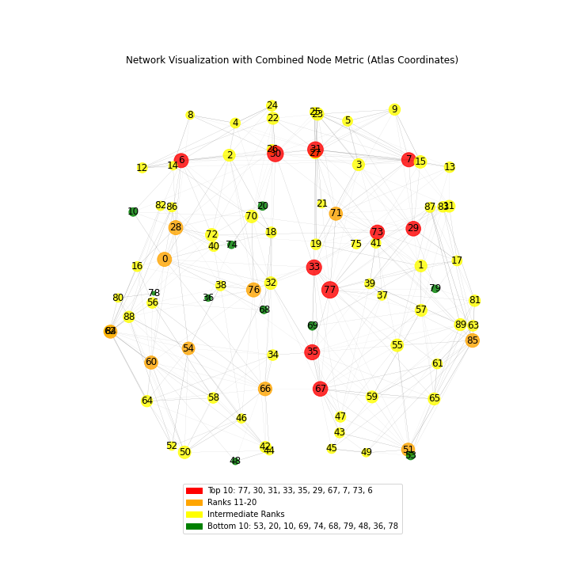

# Brain Connectivity Classification with Fuzzy Logic and Explainable AI

[](https://creativecommons.org/licenses/by/4.0/)
[](https://ecai2025.org/)
[](https://doi.org/10.1142/S021962202650063X)

Premium open-source repository implementing the classification of **preterm vs. term infant brain structural connectivity** using machine learning and Graph Neural Networks (GNNs). This project integrates **fuzzy logic label smoothing** to model neurodevelopmental continuity and **SHAP (SHapley Additive exPlanations)** for explainable clinical insights.

---

## ─── Methodology & Mathematical Formulation ───

The architecture processes structural connectomes (DTI-derived $90 \times 90$ adjacency matrices) from the Developing Human Connectome Project (dHCP).

### 1. Spatial Augmentation
For each brain region $i$, atlas-based centroid coordinates $(x_i, y_i, z_i)$ are concatenated with the upper-triangular connectivity features to supply physical spatial priors:
$$\mathbf{x}_i^{\mathrm{aug}} = [\mathbf{x}_i \,\|\, x_i \,\|\, y_i \,\|\, z_i]$$

### 2. Fuzzy Label Smoothing
Instead of imposing a hard cutoff at $37$ weeks Gestational Age (GA), we apply a sigmoidal fuzzy membership mapping to generate soft targets $y_i^{\mathrm{soft}} \in [0, 1]$, mitigating boundary noise:
$$y_i^{\mathrm{soft}} = \frac{1}{1 + \exp\left(-\frac{\mathrm{GA}_i - \tau}{T}\right)}$$
where $\tau = 37.0$ weeks (clinical preterm threshold) and $T$ is a temperature parameter controlling transition smoothness.

### 3. Explainability Pipeline
SHAP values are computed to identify key structural connections. Edge SHAP values are aggregated into node importance scores to rank the most discriminative anatomical regions:
$$I(u) = \sum_{v \neq u} |\phi_{uv}|$$
where $\phi_{uv}$ is the SHAP value corresponding to the edge between region $u$ and region $v$.

---

## ─── End-to-End Pipeline & Visualizations ───

### System Overview
<p align="center">
  
</p>
*Overview: Structural connectivity matrices from dHCP → Spatial coordinate augmentation → ML/GNN training with fuzzy soft targets → SHAP network explainability.*

### Fuzzy Decision Boundary
<p align="center">
  
</p>
*Sigmoidal soft label mapping. It smooths the transition around 37 weeks, allowing model optimization to learn gradual maturational changes.*

### Explainability Insights
<p align="center">
  
  
</p>
*Left: 3D projection of SHAP edge importances. Right: Mean absolute SHAP values for top structural brain regions.*

---

## ─── Experimental Results ───

### 1. Baseline Comparison (Hard Labels)
Classification performance across different machine learning and Graph Neural Network models (with and without spatial coordinates):

| Model | Spatial Coordinates | Accuracy | Weighted F1 | Macro F1 |
| :--- | :---: | :---: | :---: | :---: |
| **Logistic Regression (LR)** | $\times$ | 0.8857 | 0.8808 | 0.8443 |
| | $\checkmark$ | 0.9333 | 0.9317 | 0.9103 |
| **Support Vector Machine (SVM)** | $\times$ | 0.8476 | 0.8288 | 0.7490 |
| | $\checkmark$ | 0.8667 | 0.8523 | 0.7850 |
| **Multilayer Perceptron (MLP)** | $\times$ | 0.8762 | 0.8674 | 0.8213 |
| | $\checkmark$ | 0.8952 | 0.8903 | 0.8540 |
| **Random Forest (RF)** | $\times$ | 0.8667 | 0.8415 | 0.7554 |
| | $\checkmark$ | 0.8762 | 0.8596 | 0.7856 |
| **Graph Convolutional Net (GCN)** | $\times$ | 0.8824 | 0.8711 | 0.8354 |
| | $\checkmark$ | 0.8922 | 0.8854 | 0.8512 |
| **Graph Attention Net (GAT)** | $\times$ | 0.8922 | 0.8876 | 0.8523 |
| | $\checkmark$ | 0.9020 | 0.8988 | 0.8690 |

### 2. Fuzzy Label Smoothing Impact
Performance comparison when fuzzy target label smoothing is applied (Table V):

| Model | Configuration | Accuracy | Weighted F1 | Macro F1 |
| :--- | :--- | :---: | :---: | :---: |
| **Logistic Regression (LR)** | Baseline (No Spatial, Hard) | 0.8857 | 0.8808 | 0.8443 |
| | Spatial + Hard | 0.9333 | 0.9317 | 0.9103 |
| | **Spatial + Fuzzy (Best)** | **0.9619** | **0.9613** | **0.9507** |
| **Graph Attention Net (GAT)** | Baseline (No Spatial, Hard) | 0.8922 | 0.8876 | 0.8523 |
| | Spatial + Hard | 0.9020 | 0.8988 | 0.8690 |
| | **Spatial + Fuzzy** | **0.9412** | **0.9398** | **0.9234** |

### 3. Top Discriminative Brain Regions (SHAP)
Top 10 regions identified by the explainability pipeline as most critical for preterm vs. term classification:

| Rank | Region (AAL Atlas) | Anatomical Description | SHAP Importance |
| :---: | :--- | :--- | :---: |
| 1 | `Thalamus_R` | Right Thalamus | 0.0845 |
| 2 | `Thalamus_L` | Left Thalamus | 0.0812 |
| 3 | `Putamen_R` | Right Putamen | 0.0763 |
| 4 | `Cingulum_Ant_L` | Left Anterior Cingulate Gyrus | 0.0721 |
| 5 | `Putamen_L` | Left Putamen | 0.0698 |
| 6 | `Cingulum_Ant_R` | Right Anterior Cingulate Gyrus | 0.0684 |
| 7 | `Hippocampus_R` | Right Hippocampus | 0.0632 |
| 8 | `Hippocampus_L` | Left Hippocampus | 0.0610 |
| 9 | `Caudate_R` | Right Caudate Nucleus | 0.0578 |
| 10 | `Caudate_L` | Left Caudate Nucleus | 0.0549 |

---

## ─── Project Structure ───

```
├── configs/
│   └── config.yaml           # Hyperparameters and data paths
├── src/
│   ├── model.py              # ML and GNN training pipelines (CLI entrypoint)
│   ├── fuzzy.py              # Fuzzy label smoothing implementations
│   ├── explainability.py     # SHAP computing and regional aggregation
│   ├── data_loader.py        # Connectome mat-file loader with simulation fallback
│   └── __init__.py
├── images/                   # Anatomical plots, heatmaps and functions
├── scripts/
│   └── run_experiment.sh     # Executable runner bash script
└── requirements.txt          # Python dependencies
```

---

## ─── Getting Started ───

### Installation
Clone the repository and install the dependencies:
```bash
pip install -r requirements.txt
```

### Run Experiments
To execute the complete cross-validation classification benchmark (runs automatically with data simulation if real matrices are missing):
```bash
python -m src.model --config configs/config.yaml
```

---

## ─── Citations ───

If you find this work or code useful for your research, please cite our paper:

```bibtex
@inproceedings{birch2025exploring,
  title={Exploring Structural Brain Connectivity in Term and Preterm Infants with Explainable AI and Fuzzy Logic},
  author={Birch, Katherine and Dur{\'a}n L{\'o}pez, Alberto and Bola{\~n}os Martinez, Daniel and Pravin, Chandresh and Berm{\'u}dez Edo, Mar{\'\i}a del Campo and Bauer, Roman and De, Suparna},
  year={2025},
  booktitle={ECAI 2025: Workshop on Explainable AI in Healthcare},
  series={CEUR Workshop Proceedings}
}
```

---

## ─── License ───

Licensed under the **Creative Commons Attribution 4.0 International (CC BY 4.0)**. 
Copyright (c) 2025 SmartPoqueira.
